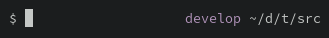

# Minimal Fish Theme



The left prompt is a single `$` character, prefixed with a red `!` upon the previous command's failure.

The right prompt is your PWD in short form (`$HOME/abc/def/ghi` is shortened to `~/a/d/ghi`) and, if you're in a Git repo, the active branch with color-denoted status.

## Installation

Install with your favourite Fish package manager, for example:

```
$ fisher install samhh/fish-minimal-theme
```

## Performance

Performance is usually imperceptibly affected, however in a massive Git repo, particularly on weaker hardware, you might notice some prompt delay. To resolve this you can install [fish-async-prompt](https://github.com/acomagu/fish-async-prompt).

